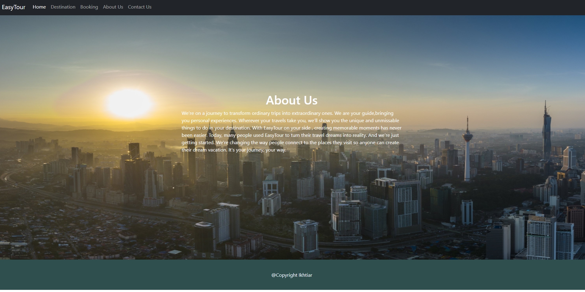

## Group: 3

**Final Report:**
[Click here](https://docs.google.com/document/d/1RLpS3rmZ1fzMcAyR4bK7gFeXsJw_n3CcugqirT6a3Xk/edit?usp=sharing)

**KULLIYYAH OF INFORMATION AND COMMUNICATION TECHNOLOGY**

**SEM 2 2021/2022**

**INFO 3305 SECTION 1**

**WEB APPLICATION DEVELOPMENT**

**EASYTOUR**

**INSTRUCTOR: MOHD KHAIRUL AZMI BIN HASSAN**

**PREPARED BY: GROUP-3**

<table>
  <tr>
   <td><strong>NAME</strong>
   </td>
   <td><strong>MATRIC NO.</strong>
   </td>
  </tr>
  <tr>
   <td><strong>MD IKHTIAR UDDIN HOWLADER (G. LEADER)</strong>
   </td>
   <td><strong>1834619</strong>
   </td>
  </tr>
  <tr>
   <td><strong>RASEL AHMED</strong>
   </td>
   <td><strong>1836247</strong>
   </td>
  </tr>
  <tr>
   <td><strong>MUHAMMAD ANIQ HARIS BIN MOHAMMED ZAKI</strong>
   </td>
   <td><strong>1920041</strong>
   </td>
  </tr>
  <tr>
   <td><strong>SAIFUDIN BIN AHMAD GANI</strong>
   </td>
   <td><strong>1929989</strong>
   </td>
  </tr>
  <tr>
   <td><strong>DING ZHILONG</strong>
   </td>
   <td><strong>1739827</strong>
   </td>
  </tr>
</table>

**TABLE OF CONTENT**

<table>
  <tr>
   <td><strong>NO.</strong>
   </td>
   <td><strong>TITLE</strong>
   </td>
   <td><strong>PAGE NO.</strong>
   </td>
  </tr>
  <tr>
   <td><strong>1.</strong>
   </td>
   <td>Project Introduction
   </td>
   <td>3
   </td>
  </tr>
  <tr>
   <td><strong>2.</strong>
   </td>
   <td>Project Objectives
   </td>
   <td>3
   </td>
  </tr>
  <tr>
   <td><strong>3.</strong>
   </td>
   <td>Project Resources
   </td>
   <td>3
   </td>
  </tr>
  <tr>
   <td><strong>4.</strong>
   </td>
   <td>Features & Functionalities
   </td>
   <td>4
   </td>
  </tr>
  <tr>
   <td><strong>5.</strong>
   </td>
   <td>System Architecture
   </td>
   <td>5
   </td>
  </tr>
  <tr>
   <td>
   </td>
   <td>     ERD Diagram
   </td>
   <td>5
   </td>
  </tr>
  <tr>
   <td>
   </td>
   <td>     Sequence Diagram
   </td>
   <td>5
   </td>
  </tr>
  <tr>
   <td><strong>6.</strong>
   </td>
   <td>Final Product
   </td>
   <td>6-9
   </td>
  </tr>
  <tr>
   <td><strong>7.</strong>
   </td>
   <td>Conclusion
   </td>
   <td>9
   </td>
  </tr>
  <tr>
   <td><strong>8.</strong>
   </td>
   <td>References
   </td>
   <td>10
   </td>
  </tr>
</table>

# **1.0 INTRODUCTION**

The name of our web application is "Easytour". Easytour is an online booking web application in which we will create an online booking system for people to choose many beautiful destinations. In our Easytour system, users will see many places that included with accommodation, transportation, tour guide and much more. Each package will come with an affordable price and users can also change their package.

# **2.0 PROJECT OBJECTIVES**

EasyTour aims to provide a variety of services for travelers, tourists, and just about any adventure enthusiasts. The EasyTour packages include transport variants via land, water, and air travel. Don’t know where to start? Well, each travel package option is assigned a tour guide as per the customer’s convenience. Just an added bonus, the multilingual tour guides allow customers to speak comfortably without feeling uneasy. The point of these types of services is simply to make the customers feel like they’re traveling to their second home worry-free. However, the highlight of the EasyTour system lies on the main objective; to showcase highly demanded travel locations at affordable prices, with organized packages for a safe travel experience. All using the PHP web application framework, specifically Laravel.

# **3.0 PROJECT RESOURCES**

System resources used to make the EasyTour a reality include:

1. Laravel MVC + Composer - the skeleton of the web application.
2. GitHub + Visual Studio Code - the code editor used, alongside the main collaborative platform.
3. XAMPP/MAMPP - web server solution for the web application.
4. PHPMyAdmin - intended to handle administration of the databases and web hosting services behind EasyTour.

# **4.0 FEATURES & FUNCTIONALITIES**

* Membership registration New customer registration is easy and takes no time, providing the best experience possible
* Simple search filters For example, it will provide you with real-time updated destination results based on the boxes you check
* Predictive search You can provide results as a search category for cities and other hotels within that city, based on the hotel name.
* Great photo displays The site displays several carefully selected images for pre-viewing, offering realistic displays of rooms and places to cycle through at your own pace.
* Customer reviews Consumer comments are the most effective sales driving force and a reliable source of information for users. Customers can get the most authentic customer comments and facilitate their own travel arrangements
* Favorites list If you haven't decided on a destination yet, the favorites list is a very useful tool to remember what briefly caught your eye in the search before.
* Keep a simple calendar An easy-to-view calendar of arrival and departure dates that pops up from the Start and return fields.
* Clearly marked price, no hidden fees Clearly marked prices, no additional charges and taxes
* Use memorable and interesting copywriting Use some good writing to describe local features and highlight local attractions
* Check out simply Simple and varied payment methods that satisfy most customers.

# **5.0 SYSTEM ARCHITECTURE**

<u>Entity Relationship Diagram (ERD)</u>

<u>Sequence Diagram</u>

# **6.0 FINAL PRODUCT**

 

# **7.0 CONCLUSION**

In conclusion, our team has been able to carry out an operational travel booking site as shown in multiple figures/images above. The images showcase the different layouts and navigation on the site. Having so much said, since EasyTour is a third-party service, it’ll require a lot of components before going live for the public. There’s so much more to consider; joint ventures & joint partnerships with vendors, social branding, bug fixes, template fixes, and the list goes on and on. Therefore EasyTour will remain as is, in its prototype stage. Clearly, the main objective which was to utilize the Laravel PHP framework along with its MVC model has been fully established - and that accomplishment is the main takeaway here.

# **8.0 REFERENCES**

* Irekasoft（February 2021）Build Laravel CRUD Web App.[https://irekasoft.com/blog/build-laravel-crud-web-app](https://irekasoft.com/blog/build-laravel-crud-web-app)
* Laravel - Basic Database Usage. https://laravel.com/docs/4.2/database
